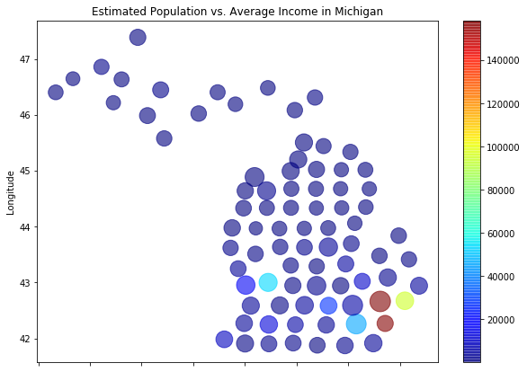
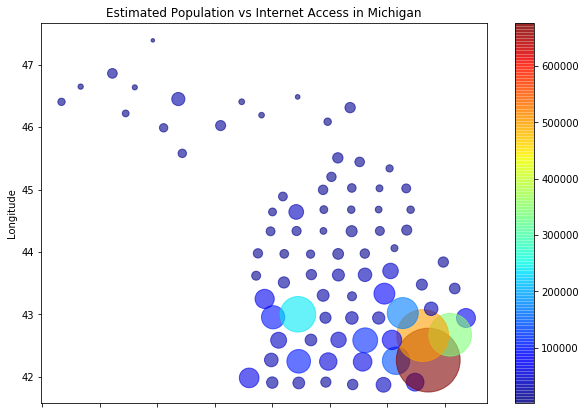
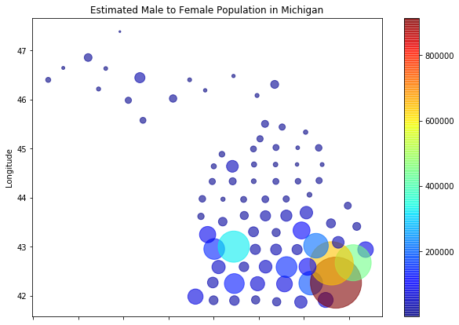

# Census-Reported-Average-Income-

Providing a another look at how you can visualize data from the U.S. Census Bureau API. To start getting your hands on the data please look below.

list of datasets

https://api.census.gov/data.html

to get variable for datasets click on "variables"

to get examples for requests click on "examples"

get your key using the following website:

https://api.census.gov/data/key_signup.html

This time my analysis show how to represent two data sets on the map.

Here's an example of a heatmap I did of Michigan showing the estimated total population versus the average income in each of those areas.
For reference Detroit is the larget bubble in the bottom right.

Finding:
- Oakland County has the largest average income at about $110,000.

Here's an example of a heatmap I did of Michigan showing the estimated total population versus the total number of individuals that have access to the internet.

Finding:
- If you're in a city it's more likely that you have access to the internet

Here's an example of a heatmap I did of Michigan showing the male to female ration.

Finding:
- More females are in the larger cities than smaller cities

